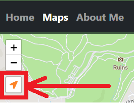
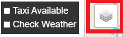
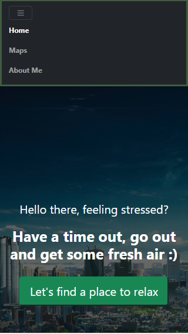
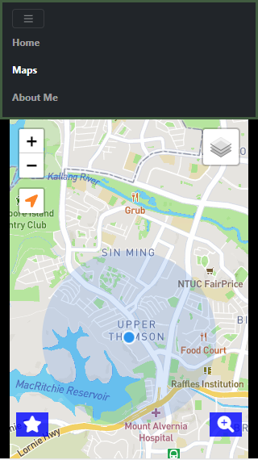
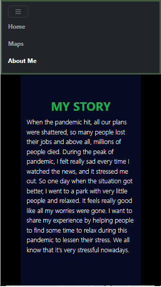

### PROJECT OVERVIEW

This project is mainly used to find good places in the area like malls and parks. It also helps the users to check the taxi availability and the weather condition. The web application can fit multiple screen, from mobile to desktop screen. 

The main goal of this project is about help people to de-stress themselves and have a quick break in their lives to go out and find some good places in the area. Most people nowadays are stressed and one of the main reasons is the pandemic.

I believe this application will be a big help to those people who are stressed, depressed, not in a good mood or those who are in any negative energy.

[Web Application link](https://bladshed.github.io/Assignment-Project-1/)

### UI/UX

* [Wireframes link](files)

* The design main colors revolves in blue, green, red and black. I chose these colors because it represent the nature's colors, blue and green are very pleasing to the eyes, red to catch the attention, black to neutralize the colors and to make it dark so it won't stressed your eyes.

### FEATURES

* The main feature of this web application is the map navigation where when you choose your location from search or from the suggested places, it will fly you to that place so you will be able to see the exact location on the map.

* I also used chart to show the statictics of stressed people, I used chart because it's easier to show informations via chart rather than using a table and the third party chart library that I used has very good UIs.

* There is one bug from leaflet plugin (I think) where when you go to other page and go back to Maps tab, it won't be able to automatically show your location.

### TECHNOLOGIES USED

* HTML
   * To build my web page

* CSS
   * To customize my html elements

* Javascript
   * I used javascript to control all the functionalities of my application, it is like the brain of my application
   * This is the main language I used to implement all the third part libraries I used
   * Some of the advance method of the script were used like forEach, array.map, etc
   * You may find the scripts [here](scripts)

* Visual Studio Code
   * IDE that I used for this project because it's easy to code here and easy to manage your files and data

### TEST CASES
<table>
   <tr>
      <th colspan=2>Home Page
   <tr>
   <tr>
      <th>
         
         <small>Action</small>
      </td>
      <th>
         
         <small>Expected Result</small>
      </td>
   <tr>
   <tr>
      <td>Click "Let's find a place to relax" button</td>
      <td>Redirects to "Maps" tab</td>
   <tr>
   <tr>
      <td>Click "Home" link</td>
      <td>Goes to "Home" page</td>
   <tr>
   <tr>
      <td>Click "Maps" link</td>
      <td>Goes to "Maps" page</td>
   <tr>
   <tr>
      <td>Click "About Me" link</td>
      <td>Goes to "About Me" page</td>
   <tr>
   <tr>
      <th colspan=2>Maps Page
   <tr>
   <tr>
      <th>
         
         <small>Action</small>
      </td>
      <th>
         
         <small>Expected Result</small>
      </td>
   <tr>
   <tr>
      <td>Click Zoom in/out buttons</td>
      <td>Map zooms in/out</td>
   <tr>
   <tr>
      <td>
         
         
Click this icon

      </td>
      <td>Navigates to your current position</td>
   <tr>
   <tr>
      <td>
         
         
Hover to this icon

      </td>
      <td>Shows taxi and weather checkboxes</td>
   <tr>
   <tr>
      <td>Click "Taxi Available" checkbox</td>
      <td>Shows all taxis available in Singapore</td>
   <tr>
   <tr>
      <td>Click "Check Weather" checkbox</td>
      <td>Shows all weather condition icons in Singapore</td>
   <tr>
   <tr>
      <td>Click a place under "Suggested Places"</td>
      <td>
         <ul>
            <li>Description modal pops up</li>
            <li>Navigates to the selected place</li>
         </ul>
      </td>
   <tr>
   <tr>
      <td>Click "MALLS" button</td>
      <td>Shows all malls in Singapore</td>
   <tr>
   <tr>
      <td>Search mall (after "MALLS" button is clicked)</td>
      <td>Shows all malls via search input</td>
   <tr>
   <tr>
      <td>Click "PARKS" button</td>
      <td>Shows all parks in Singapore</td>
   <tr>
   <tr>
      <td>Search park (after "PARKS" button is clicked)</td>
      <td>Shows all malls via search input</td>
   <tr>
   <tr>
      <th colspan=2>About Me Page
   <tr>
   <tr>
      <th>
         
         <small>Action</small>
      </td>
      <th>
         
         <small>Expected Result</small>
      </td>
   <tr>
   <tr>
      <td>Go to "About Me" page</td>
      <td>
         <ul>
            <li>Should see MY STORY content</li>
            <li>Should see Stress statistics chart with content</li>
            <li>Should see Journet to relaxation content</li>
            <li>Should see Quick guide content with image</li>
            <li>Should see footer quote</li>
         </ul>
      </td>
   <tr>
   <tr>
      <th colspan=2>Mobile size page
   <tr>
   <tr>
      <th>
         
         <small>Action</small>
      </td>
      <th>
         
         <small>Expected Result</small>
      </td>
   <tr>
   <tr>
      <td>
         
         <ol>
            <li>Adjust your screen to mobile size</li>
            <li>Go to home page</li>
         </ol>
      </td>
      <td>Should be able to adjust to mobile screen size</td>
   <tr>
   <tr>
      <td>
         
         <ol>
            <li>Adjust your screen to mobile size</li>
            <li>Go to maps page</li>
         </ol>
      </td>
      <td>Should be able to adjust to mobile screen size</td>
   <tr>
   <tr>
      <td>
         
         <ol>
            <li>Adjust your screen to mobile size</li>
            <li>Go to about me page</li>
         </ol>
      </td>
      <td>Should be able to adjust to mobile screen size</td>
   <tr>
</table>

### PLATFORM USED

* Github for CI/CD
* To deploy my project to your local machine
   1. Go to [Assignment-Project-1](https://github.com/bladshed/Assignment-Project-1)
   2. Download my project repository
     > `gh repo clone bladshed/Assignment-Project-1`
* Dependencies used
   * Bootstrap (for my CSS)
      * I used bootstrap in my entire UI web application because it's super easy to manipulate html elements and they also provide basic element designs where I was able to save a lot time in designing like my buttons, navbar, etc.

   * Leaflet
      * I used leaflet for my maps (Maps tab), the reason why I chose Leaflet is because it is beginner friendly and the guides from their web page is not that complicated to understand. Also, this is the library that we used in all of our map lessons.

   * Apexcharts
      * I used only one chart just to show that I am able to use a third party chart library. You may find the chart in About me tab.

   * Google fonts and Font awesome
      * These two libraries were used for my fonts and icons. They have cool fonts and icons.

### CREDITS
* For my mall images 
   * [sg.hotels.com](https://sg.hotels.com/go/singapore/best-singapore-shopping-malls)
* For my park images 
   * [timeout.com](https://www.timeout.com/singapore/things-to-do/the-prettiest-parks-in-singapore)